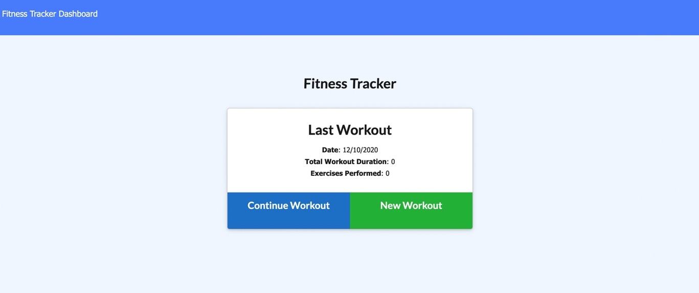
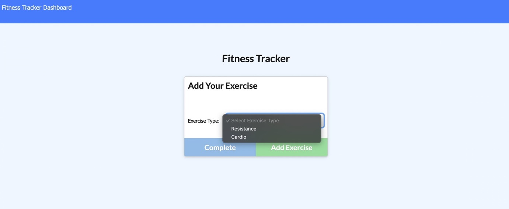
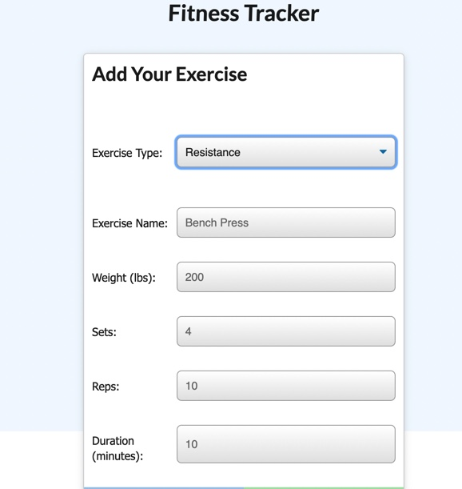

# Workout Tracker

For this assignment, you'll create a workout tracker. You have already been provided with the front end code in the `Develop` folder. This assignment will require you to create Mongo database with a Mongoose schema and handle routes with Express.

## User Story

* As a user, I want to be able to view create and track daily workouts. I want to be able to log multiple exercises in a workout on a given day. I should also be able to track the name, type, weight, sets, reps, and duration of exercise. If the exercise is a cardio exercise, I should be able to track my distance traveled.

## Business Context

A consumer will reach their fitness goals more quickly when they track their workout progress.

## Acceptance Criteria

When the user loads the page, they should be given the option to create a new workout or continue with their last workout.

The user should be able to:

  * Add exercises to a previous workout plan.

  * Add new exercises to a new workout plan.

  * View the combined weight of multiple exercises on the `stats` page.

To deploy an application with a MongoDB database to Heroku, you'll need to set up a MongoDB Atlas account and connect a database from there to your application. Be sure to use the following guides for support:

  * [Set Up MongoDB Atlas](../04-Supplemental/MongoAtlas-Setup.md)

  * [Deploy with Heroku and MongoDB Atlas](../04-Supplemental/MongoAtlas-Deploy.md)

## Application Description

Home Page: When users landed on the home page, users can see the last workout tracker they have created ot they can create a new workout tracker.

Create Exetcise: New users can create their own new workout tracker 

Users can select the types of workout 

## Creators
Project created by: Venus Hu 

Github: 
https://github.com/Venus1001/Workout-Tracker.git